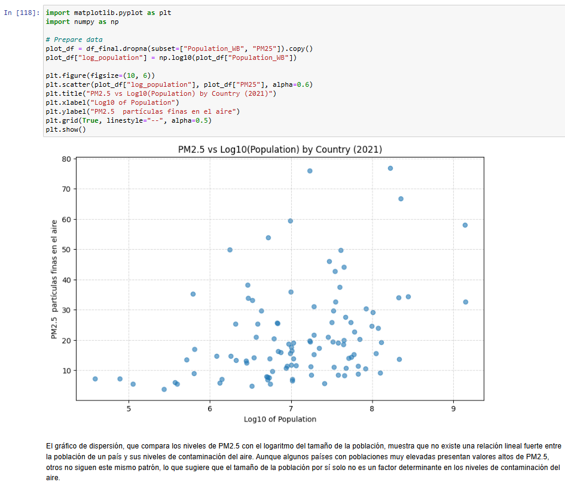

Real-world Data Wrangling: Population & Air Pollution (PM2.5)
📌 Descripción general
Este proyecto aplica técnicas de limpieza y preparación de datos del mundo real (Data Wrangling) para analizar la relación entre el tamaño de la población de los países y los niveles de contaminación del aire, medidos mediante el indicador PM2.5, en el año 2021.
Para ello, se recopilan, evalúan, limpian y combinan dos conjuntos de datos reales procedentes de fuentes públicas. El proyecto sigue un flujo de trabajo completo y reproducible, desde la obtención de los datos hasta el análisis exploratorio y la generación de visualizaciones.

🎯 Objetivo del proyecto
Responder a la siguiente pregunta de investigación:

¿Existe una relación entre el tamaño de la población de los países y los niveles de contaminación del aire (PM2.5) en el año 2021?

🧰 Tecnologías utilizadas

Python
pandas
numpy
matplotlib
Jupyter Notebook

📊 Conjuntos de datos utilizados
Los datos se descargaron manualmente desde Kaggle y se documentan con enlaces públicos para garantizar la reproducibilidad.

World Population by Country (1960–2021)
Dataset de población por país basado en datos del Banco Mundial.

IQAir – Air Quality Index (PM2.5)
Dataset con datos de contaminación del aire a nivel país (PM2.5).

👉 Los enlaces directos a las fuentes originales se encuentran en el archivo:
📄 DATASETS_SOURCES.txt

🔄 Flujo de trabajo
El proyecto sigue las siguientes etapas:

Recolección de datos
Carga y exploración inicial de múltiples datasets reales.

Evaluación de los datos (Assess)
Identificación de problemas de:

Calidad de los datos (valores faltantes, tipos inválidos).
Estructura (tidiness).

Limpieza de los datos (Clean)

Conversión de tipos de datos numéricos.
Gestión de valores faltantes.
Transformación de formato ancho a formato ordenado (wide → long).
Combinación de datasets por país y año.

Almacenamiento de datos
Separación clara entre datos originales (data/raw) y datos limpios (data/clean).

Análisis y visualización
Análisis exploratorio y generación de visualizaciones para responder a la pregunta de investigación.

📁 Estructura del repositorio

.
├── Data_Wrangling_Project_Starter.ipynb

├── README.md

├── DATASETS_SOURCES.txt

├── data/

│   ├── raw/

│   │   └── (datasets originales)

│   └── clean/

│       └── population_air_quality_2021_clean.csv

Resultados principales

No se observa una relación lineal fuerte entre el tamaño de la población de un país y sus niveles de PM2.5.
Algunos países muy poblados presentan altos niveles de contaminación, pero otros no, lo que indica que la población por sí sola no determina la contaminación del aire.
Factores adicionales como la industrialización, las fuentes de energía, las políticas ambientales y el grado de urbanización podrían tener un impacto significativo.

## 📈 Visualizaciones destacadas

### Relación entre población y contaminación del aire (PM2.5)

Este gráfico de dispersión muestra que no existe una relación lineal fuerte entre
el tamaño de la población de un país y sus niveles de PM2.5 en 2021.

---

### Países con mayores niveles de PM2.5 (2021)

El gráfico de barras destaca que los países con mayores niveles de PM2.5 no son
necesariamente los más poblados.

🔁 Reproducibilidad

Los datos originales se conservan sin modificar en data/raw.
Los datos limpios y combinados se almacenan en data/clean.
Las fuentes de datos están documentadas con enlaces públicos.

👤 Autor
José Luis Lázaro Contreras
Proyecto desarrollado como parte de formación en análisis y preparación de datos.

📌 Notas finales
Este proyecto demuestra habilidades prácticas en Data Wrangling, incluyendo evaluación de calidad de datos, limpieza, transformación de estructuras, combinación de fuentes y análisis exploratorio, siguiendo buenas prácticas profesionales y orientadas a la reproducibilidad.
